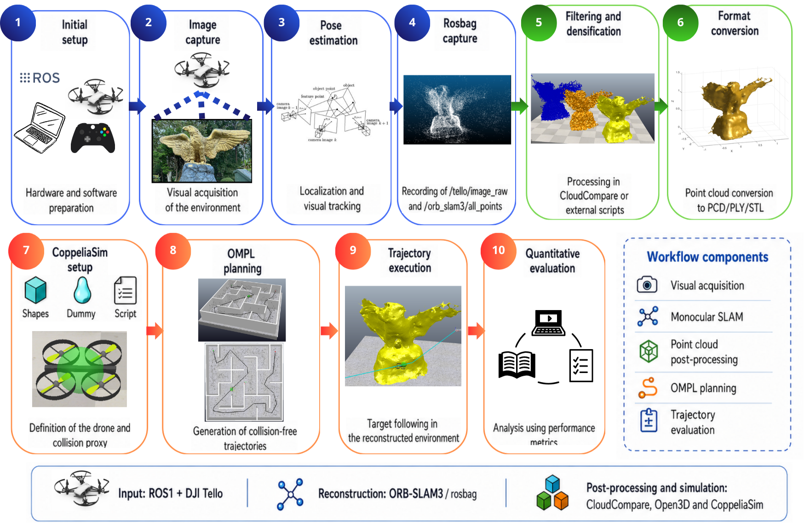

# GPS-Denied Drone Navigation Using Visual SLAM and OMPL-Based Motion Planning

This repository supports the paper:

**"Autonomous Navigation of Low-Cost Drones in GPS-Denied Environments Using Visual SLAM and OMPL-Based Motion Planning"**

It contains CoppeliaSim scenes, Lua scripts, processed 3D models, analysis resources, and supplementary videos for reproducing and visually validating the planner benchmarking results presented in the paper.

---

## Project Information

**Authors**

- Roman Velasquez-Reyes  
- Gerardo Díaz-Arango  
- Arturo Sarmiento-Reyes  

**Contact**

- Roman Velasquez-Reyes: `rogavere@inaoep.mx`
- Gerardo Díaz-Arango: `gudadiazgd@gmail.com`
- Arturo Sarmiento-Reyes: `jarocho@inaoep.mx`

---

## Workflow Overview

The proposed workflow connects low-cost monocular visual mapping, point-cloud post-processing, simulation-ready map construction, and OMPL-based motion planning in CoppeliaSim.

The general pipeline includes:

1. Visual data acquisition using a DJI Tello drone.
2. Monocular Visual SLAM reconstruction using ORB-SLAM3 and ROS1.
3. Point-cloud filtering, densification, conversion, and scaling.
4. Import of the processed reconstruction into CoppeliaSim.
5. Collision-aware motion planning using OMPL planners.
6. Target-following execution and quantitative evaluation.

## Supplementary simulations and trajectory executions are available in the following video playlist:

[https://youtu.be/xIe7PP6e23Y]

The videos provide visual examples of the planned trajectories and target-following executions for the evaluated OMPL planners.
